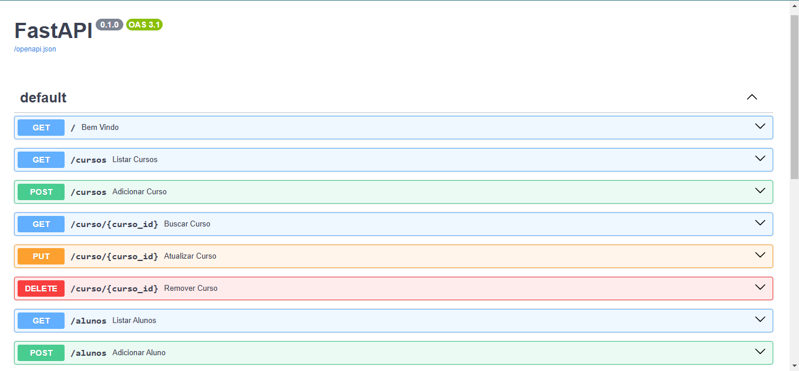
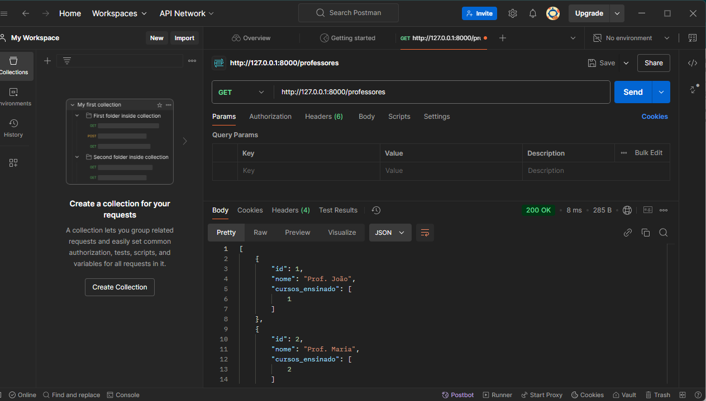

```markdown
# Sistema de Gerenciamento de Cursos e Alunos

Este é um projeto básico desenvolvido com FastAPI, que oferece funcionalidades CRUD para gerenciar alunos, cursos e professores.  

---

## 📋 Requisitos

- **Python**: 3.9 ou superior  
- **Dependências do projeto** (instaladas via `pip`):
  - `fastapi`
  - `uvicorn`

---

## 🚀 Como executar o projeto

1. Clone o repositório:
   ```bash
   git clone https://github.com/usuario/nome-do-repositorio.git
   cd nome-do-repositorio
   ```

2. Crie um ambiente virtual:
   ```bash
   python -m venv venv
   source venv/bin/activate   # Linux/MacOS
   venv\Scripts\activate      # Windows
   ```

3. Instale as dependências:
   ```bash
   pip install -r requirements.txt
   ```

4. Execute o servidor:
   ```bash
   uvicorn main:app --reload
   ```

5. Acesse a aplicação no navegador:
   - Documentação interativa: [http://127.0.0.1:8000/docs](http://127.0.0.1:8000/docs) (Swagger UI)
   - Alternativa de documentação: [http://127.0.0.1:8000/redoc](http://127.0.0.1:8000/redoc)

---

## 📂 Estrutura do projeto

```plaintext
.
├── venv/                  # Ambiente virtual
├── main.py                # Arquivo principal da aplicação
├── requirements.txt       # Dependências do projeto
├── assets                 # Imagens do projeto
├── __pycache__/           # Cache gerado pelo Python
└── README.md              # Documentação do projeto
```

---

## 🧾 Endpoints

### **Aluno**
| Método | Endpoint         | Descrição                 |
|--------|-------------------|---------------------------|
| GET    | `/alunos`        | Lista todos os alunos     |
| POST   | `/alunos`        | Cria um novo aluno        |
| GET    | `/alunos/{id}`   | Detalhes de um aluno      |
| PUT    | `/alunos/{id}`   | Atualiza um aluno         |
| DELETE | `/alunos/{id}`   | Remove um aluno           |

### **Curso**
| Método | Endpoint         | Descrição                 |
|--------|-------------------|---------------------------|
| GET    | `/cursos`        | Lista todos os cursos     |
| POST   | `/cursos`        | Cria um novo curso        |
| GET    | `/cursos/{id}`   | Detalhes de um curso      |
| PUT    | `/cursos/{id}`   | Atualiza um curso         |
| DELETE | `/cursos/{id}`   | Remove um curso           |

### **Professor**
| Método | Endpoint         | Descrição                 |
|--------|-------------------|---------------------------|
| GET    | `/professores`   | Lista todos os professores|
| POST   | `/professores`   | Cria um novo professor    |
| GET    | `/professores/{id}` | Detalhes de um professor |
| PUT    | `/professores/{id}` | Atualiza um professor     |
| DELETE | `/professores/{id}` | Remove um professor       |

---

## 📸 Imagens da API

### 📘 Swagger UI



### 📗 Testando com Postman


---

## 🌟 Contribuições

Contribuições são bem-vindas! Siga as etapas abaixo para contribuir:
1. Faça um fork do repositório.
2. Crie uma nova branch: `git checkout -b minha-branch`.
3. Faça suas alterações e commit: `git commit -m "Descrição das alterações"`.
4. Envie para o repositório remoto: `git push origin minha-branch`.
5. Abra um Pull Request.

---

## 📄 Licença

Este projeto está sob a licença [MIT](LICENSE).

---

Desenvolvido com ❤️ por [Wesnei](https://github.com/Wesnei).
```
